# TerraformWordPress

Deploys a self-hosted WordPress site on AWS EC2 (Ubuntu), fully provisioned
with Terraform: a dedicated VPC, public subnet, internet gateway, route
table, security group, and the EC2 instance itself with Apache, PHP,
MariaDB and WordPress installed automatically via a `user_data` script on
first boot.

## Architecture

```
Internet
   │
   ▼
Internet Gateway ── attached to ──▶ VPC (10.0.0.0/16)
                                        │
                                        ▼
                                Public Subnet
                                (route table: 0.0.0.0/0 → IGW)
                                        │
                                        ▼
                          Security Group (wordpress_sg)
                          allows: 22 (SSH), 80 (HTTP)
                                        │
                                        ▼
                            EC2 Instance (Ubuntu)
                     Apache2 + PHP + MariaDB + WordPress
                        installed by user_data.sh on boot
```

## Files

| File | Purpose |
|---|---|
| `provider.tf` | AWS provider configuration |
| `variables.tf` | All input variables (region, instance size, DB credentials, network CIDRs, ports) |
| `main.tf` | VPC, Internet Gateway, public subnet, route table, security group, EC2 instance |
| `user_data.sh` | Bash script run on first boot — installs Apache, PHP, MariaDB, downloads and configures WordPress |
| `output.tf` | Instance ID, public IP, and public DNS of the deployed site |
| `terraform.tfvars` | Real values for sensitive/required variables (gitignored never commit this) |
| `screenshot` | screenshot of the prjoect|

## Prerequisites

- [Terraform](https://developer.hashicorp.com/terraform/install) >= 1.5
- An AWS account with credentials configured (`aws configure`, or environment variables)
- An EC2 key pair created via the **AWS Console** (EC2 → Key Pairs → Create key pair). This downloads a `.pem` file once  keep it local, never commit it, and run `chmod 400` on it before use. Terraform references this key pair **by name only** (`var.key_name`); it does not create or manage the key pair itself, since the console already registers the public half with AWS.

## Variables

Set these in `terraform.tfvars` (see `variables.tf` for full descriptions/defaults):

```hcl
aws_region    = "eu-west-1"
instance_type = "t2.micro"
ami_id        = "ami-xxxxxxxxxxxxxxxxx"   # Ubuntu 22.04 AMI for your region
key_name      = "wordpress_key"            # must already exist in AWS, see Prerequisites

db_name     = "wordpress"
db_user     = "wpuser"
db_password = "ChangeMe123!"

vpc_cidr            = "10.0.0.0/16"
public_subnet_cidr  = "10.0.1.0/24"
availability_zone   = "eu-west-1a"

ssh_port     = 22
http_port    = 80
allowed_cidr = ["0.0.0.0/0"]
```

`db_name`, `db_user`, and `db_password` have no defaults and are marked
`sensitive` .Terraform will refuse to `plan`/`apply` without them supplied
here (or via `-var`/`TF_VAR_*`), and won't print them in CLI output.

## Deploy

```bash
terraform validate
terraform init
terraform plan
terraform apply
```

Type `yes` to confirm. Deployment takes about 1–2 minutes for AWS to
provision the network and instance; WordPress itself finishes installing
another 1–2 minutes after that as `user_data.sh` runs on first boot.
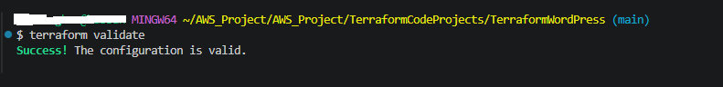

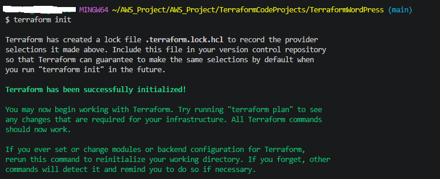

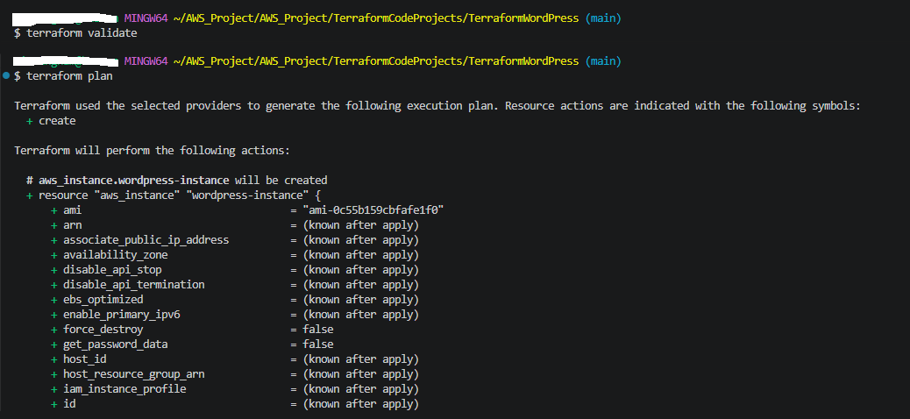

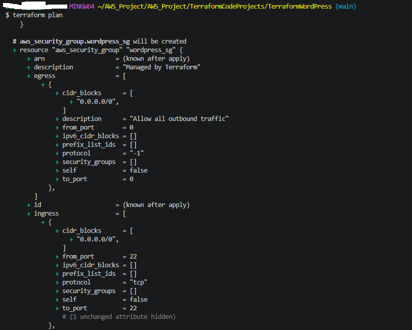

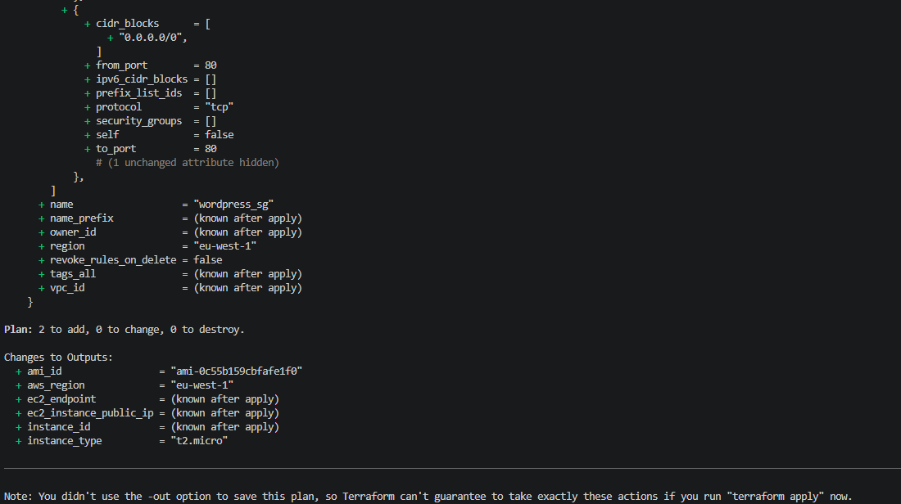

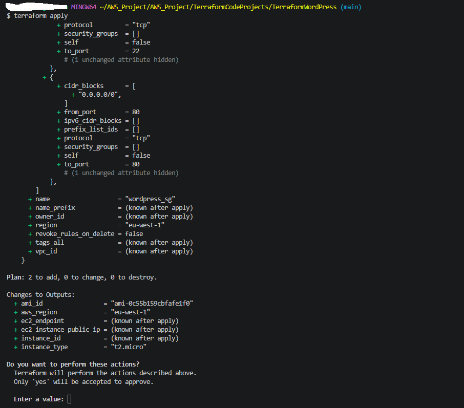

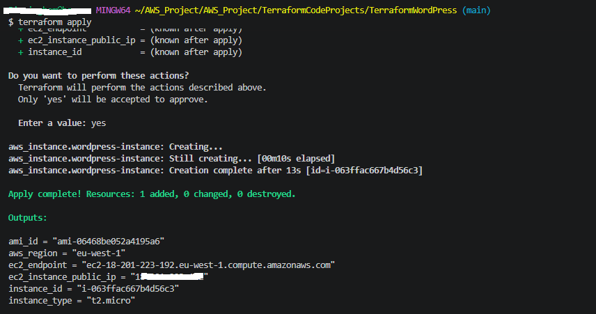
## Access WordPress

Get the public IP/DNS:

```bash
terraform output ec2_instance_public_ip
terraform output ec2_endpoint
```

1. Visit `http://<public-ip>/` .First visit lands on WordPress's own
   install wizard (site title, admin username/password/email). This
   creates your **WordPress admin account** separate from your SSH key
   and separate from `db_user`/`db_password`.
   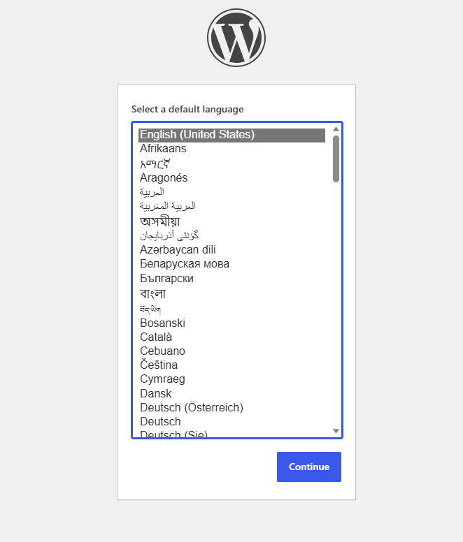
2. Complete the wizard, then log into the dashboard at
   `http://<public-ip>/wp-admin`.
   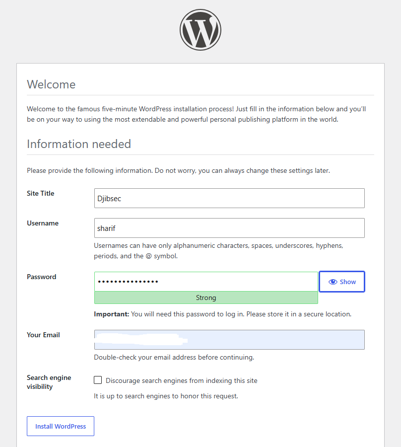
   
  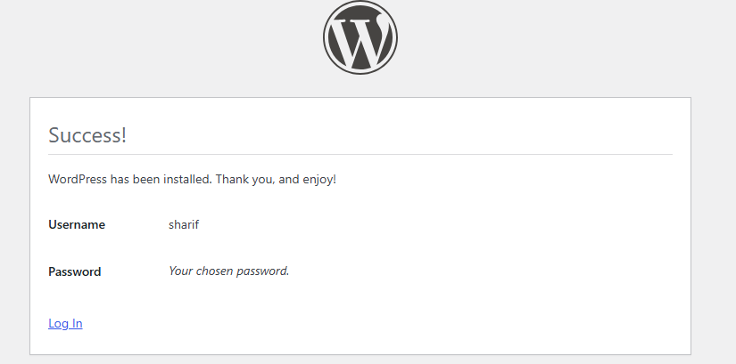


3. The public site itself is just `http://<public-ip>/`.
 
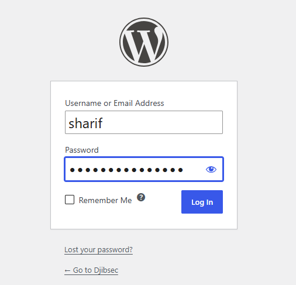

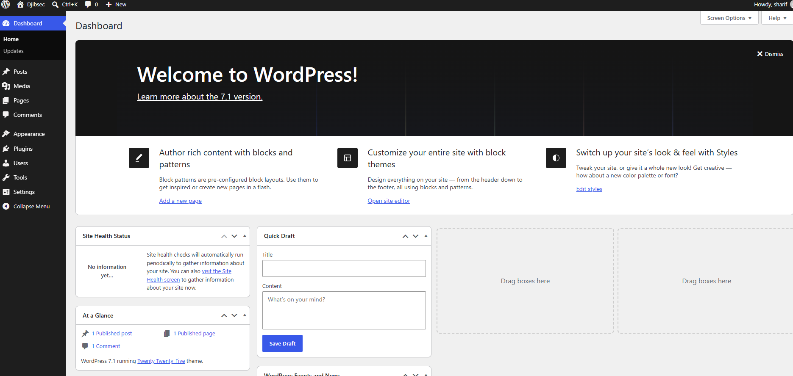
SSH access (Ubuntu's default user is `ubuntu`, not `ec2-user`):

```bash
ssh -i wordpress_key.pem ubuntu@<public-ip>
```
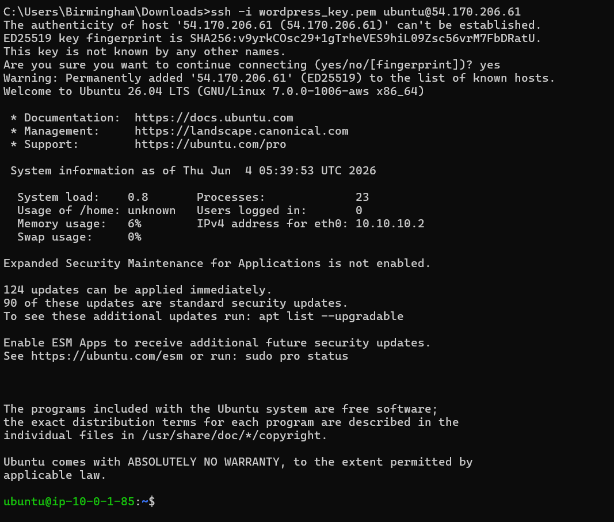
## What `user_data.sh` does

On first boot, as root, with no manual steps:

1. `apt-get update` and installs Apache2, PHP + required extensions, and MariaDB
2. Starts and enables both Apache and MariaDB
3. Creates the WordPress database and a dedicated DB user (via a `mysql <<SQL` heredoc, using the credentials passed in from Terraform)
4. Downloads and extracts the latest WordPress release
5. Copies WordPress into `/var/www/html/`, generates `wp-config.php` from the sample file, and substitutes in the real DB name/user/password with `sed`
6. Removes Ubuntu's default `/var/www/html/index.html` placeholder (Apache serves `index.html` before `index.php` by default without this step, the "Apache2 Default Page" keeps showing instead of WordPress even after everything is installed correctly)
7. Sets ownership of `/var/www/html` to `www-data` (Ubuntu's Apache user) and restarts Apache
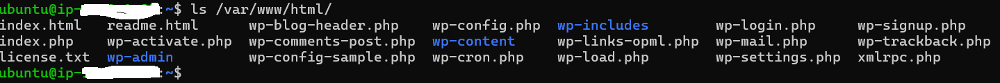
## Troubleshooting notes (from getting this working)

- **`ERR_CONNECTION_TIMED_OUT` on every port** almost always a missing
  route to the internet, not a security group problem. Confirm the
  subnet's route table has a `0.0.0.0/0 → igw-xxxxx` entry, and that the
  Internet Gateway is actually attached to the VPC.
- **`Security group and subnet belong to different networks`** — the
  security group and the instance's subnet must be in the *same* VPC.
  Make sure `aws_security_group.wordpress_sg` has `vpc_id = aws_vpc.main.id`
  set explicitly; without it, the SG defaults to the account's default VPC.
- **`security_groups` vs `vpc_security_group_ids`** always use
  `vpc_security_group_ids = [aws_security_group.wordpress_sg.id]` for a
  custom VPC. The `security_groups` (by name) argument only works in
  EC2-Classic or the default VPC and will error or silently misbehave
  otherwise.
  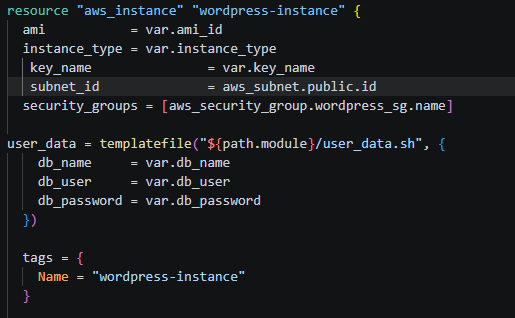
  
  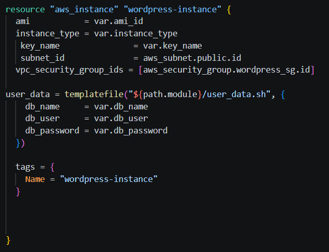
- **Site loads but shows "Apache2 Default Page" instead of WordPress** .
  see step 6 above; delete `/var/www/html/index.html`.
  
- **`templatefile()`/`file()` "no file exists"** ,Terraform doesn't
  expand `$SOME_VAR` like a shell. Use `${path.module}/user_data.sh` to
  reference a script sitting next to your `.tf` files.

## Screenshots

Add these to a `screenshots/` folder in this repo:

1.`validate.png`— successful `terraform validate` output
2. `plan.png` and `plan1.png` and `plan2.png`— successful `terraform plan` output
3. `apply.png` and `apply1.png` — successful `terraform apply` output
4. `wordpress.png` and `wordpress1.png` and `wordpress2.png`— the WordPress setup screen on first visit
5. `wordpress4.png` — the live WordPress homepage
6. `wordpress3.png` and `wordpress4.png`— logged into `wp-admin`

## Cleanup

```bash
terraform destroy
```
