# Assignment 1 — VPC & Networking

A full custom AWS network built from scratch, covering VPC design, subnetting, routing, NAT/IGW internet access, EC2 placement, and security group segmentation.

## Objective

Create a custom VPC with one public and one private subnet, configure correct routing for internet access, and deploy EC2 instances across both subnets with appropriate security controls.

## Table of Contents

- [Architecture](#architecture)
- [Prerequisites](#prerequisites)
- [Task 1 — Create the VPC](#task-1--create-the-vpc)
- [Task 2 — Internet Access (IGW, EIP, NAT Gateway)](#task-2--internet-access-igw-eip-nat-gateway)
- [Task 3 — Route Tables](#task-3--route-tables)
- [Task 4 — EC2 Instances](#task-4--ec2-instances)
- [Task 5 — Security Groups](#task-5--security-groups)
- [Bonus — Bastion Host & CloudWatch](#bonus--bastion-host--cloudwatch)
- [Verification / Testing](#verification--testing)
- [Screenshot Checklist](#screenshot-checklist)
- [Terraform (optional automation)](#terraform-optional-automation)
- [Cleanup](#cleanup)

## Architecture
  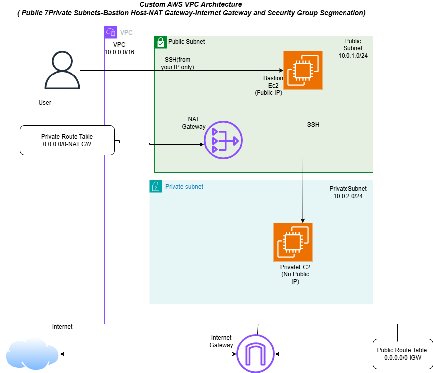


## Component
| Component | CIDR / Value |
|---|---|
| VPC | `10.0.0.0/16` |
| Public Subnet | `10.0.1.0/24` |
| Private Subnet | `10.0.2.0/24` |
| Availability Zone | e.g. `us-east-1a` (pick one AZ for both subnets, or split across two — either satisfies the assignment) |

## Prerequisites

- An AWS account with console/CLI access
- An EC2 key pair (create one under **EC2 → Key Pairs** if you don't have one, or let the console generate one on launch)
- Your current public IP address (for locking down SSH/HTTP), e.g. via `curl ifconfig.me`
- (Optional) AWS CLI configured, and/or Terraform installed if you use the automation path below

## Task 1 — Create the VPC

**Console: VPC → Your VPCs → Create VPC**

1. Choose **VPC only**.
2. Name: `MYVPC_PROD`
3. IPv4 CIDR: `10.0.0.0/16`
4. Leave IPv6 and tenancy at defaults → **Create VPC**

**Create the subnets: VPC → Subnets → Create subnet**

| Subnet | VPC | AZ | CIDR | Auto-assign public IPv4 |
|---|---|---|---|---|
| `MyPublicSubnet` | assigne to MYVPC_PROD| az-a | `10.0.1.0/24` | **Enable** (Subnet actions → Edit subnet settings) |
| `MyPrivateSubnet` | assign to MYVPC_PROD| az-a (or az-b) | `10.0.2.0/24` | Leave disabled |

> 📸 **Screenshot:** VPC resource map (VPC dashboard → your VPC )
 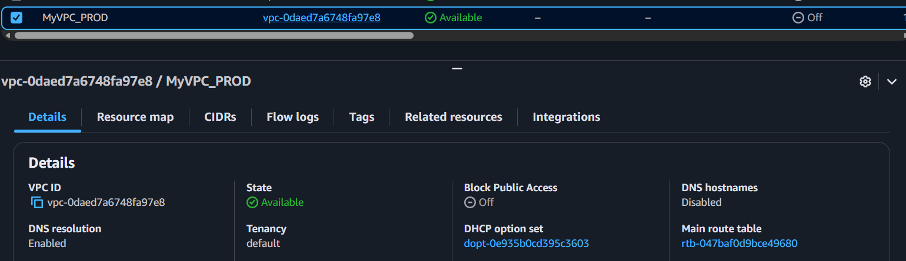
> 📸 **Screenshot:** Public  Subnet
 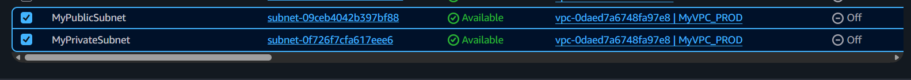

## Task 2 — Internet Access (IGW, EIP, NAT Gateway)

**Internet Gateway: VPC → Internet Gateways → Create internet gateway**

1. Name: `MYInternetGW` → Create
2. Select it → **Actions → Attach to VPC** → choose `MYVPC_PROD`
   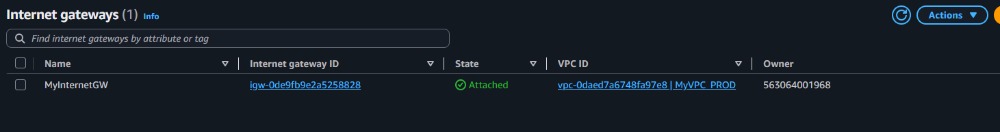


**NAT Gateway: VPC → NAT Gateways → Create NAT gateway**

1. Name: `MyNATGateway`
2. Subnet: **`MyPublicSubnet`** (NAT gateways must live in a public subnet)
3. Connectivity type: **Public**
4. Elastic IP: select `"I have masked the elastic IP"`
5. Create — wait until status is **Available** (can take a few minutes)

> 📸 **Screenshot:** NAT Gateway detail page showing `Available` state and the associated Elastic IP.
 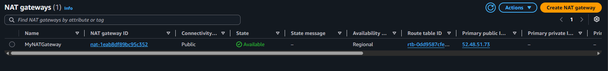

## Task 3 — Route Tables

**Public route table: VPC → Route Tables → Create route table**

1. Name: `MyPublicRouteTable`, VPC: `MYVPC_PROD`
2. **Routes tab → Edit routes → Add route**: Destination `0.0.0.0/0` → Target: **Internet Gateway** (`Internet`)
3. **Subnet associations tab → Edit subnet associations** → select `MyPublicSubnet`

> 📸 **Screenshot:** Public Route Table
 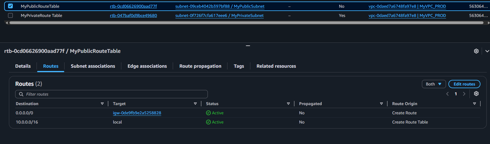
> 📸 **Screenshot:** Public Route Table with subnet associated
 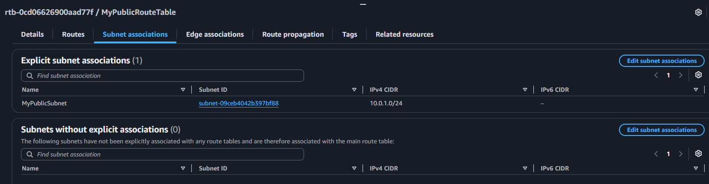
> 
**Private route table: VPC → Route Tables → Create route table**

1. Name: `MyPrivateRouteTable`, VPC: `MYVPC_PROD`
2. **Routes tab → Edit routes → Add route**: Destination `0.0.0.0/0` → Target: **NAT Gateway** (`MyNATGateway`)
3. **Subnet associations tab → Edit subnet associations** → select `MyPrivateSubnet`

> 📸 **Screenshot:** Private Route Table
 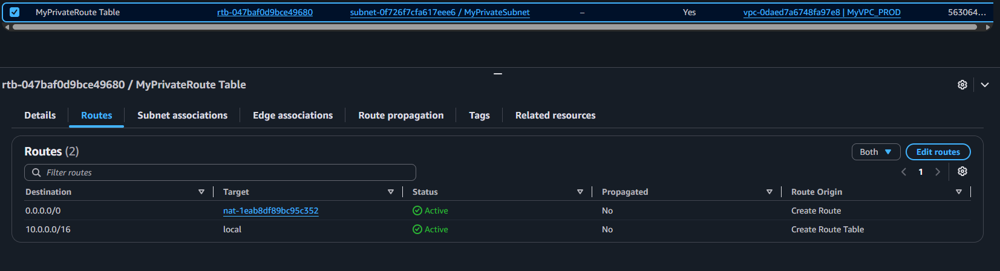
> 📸 **Screenshot:** Private Route Table with subnet associated
 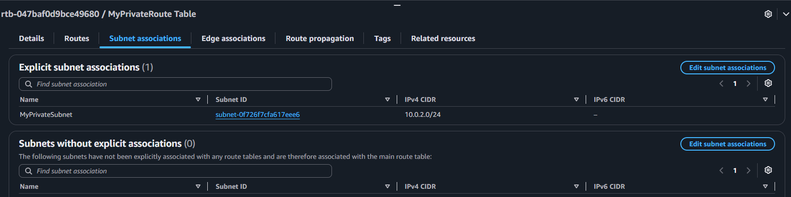

## Task 4 — EC2 Instances
> 📸 **Screenshot:** EC2 instance list showing both instances running, with the Public EC2's public IPv4 column populated and the Private EC2's blank.
 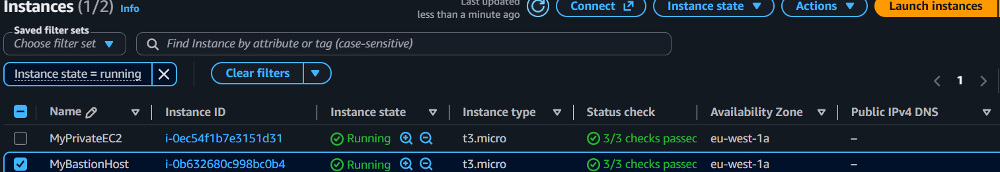

**Public EC2: EC2 → Instances → Launch instances**

1. Name: `MyBastionHost`
2. AMI: Amazon Linux 2023 (or Ubuntu — your choice)
3. Instance type: `t2.micro` / `t3.micro` (free-tier eligible)
4. Key pair: select or create one
5. Network settings → Edit:
   - VPC: `MYVPC_PROD`
   - Subnet: `MyPublicSubnet`
   - Auto-assign public IP: **Enable**
   - Security group: create new  `Public_SG` → SSH port 22 anywhere ( for security preferrable only to MY IP) and  http port 80
6. Launch
> 📸 **Screenshot:** Connecting Bastion host in port 22
 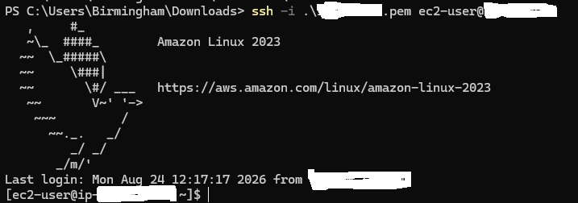

> 📸 **Screenshot:** HTTP access on Bastion Host
 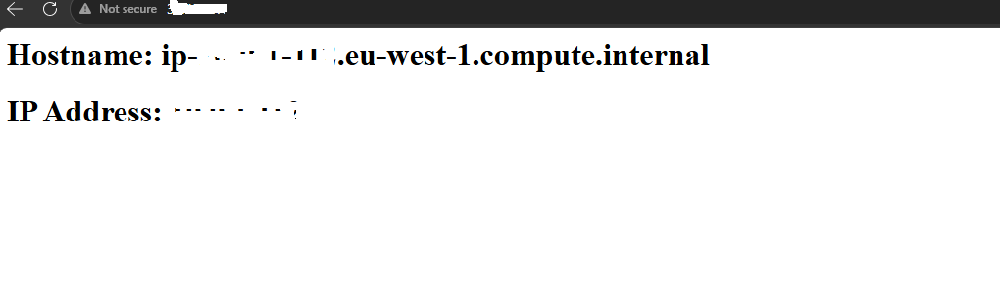
> 
**Private EC2: EC2 → Instances → Launch instances**

1. Name: `MyPrivateEC2`
2. Same AMI/instance type
3. Same key pair as Bastion Host
4. Network settings → Edit:
   - VPC: `MYVPC_PROD`
   - Subnet: `MyPrivateSubnet`
   - Auto-assign public IP: **Disable**
   - Security group: create new `Private_SG`→ SSH port 22 only from Bastion Host security group
5. SSH to MyPrivateEC2 from Bastion Host port 22
> 📸 **Screenshot:** Connecting from Bastion host to PrivateEC2 in port 22
 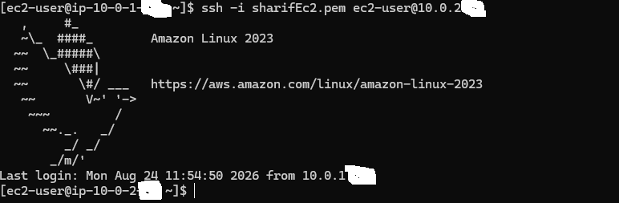


> 
## Task 5 — Security Groups

**`Public_SG`** (attached to Public EC2)

| Direction | Type | Port | Source/Destination |
|---|---|---|---|
| Inbound | SSH | 22 | Your IP `/32` (e.g. `203.0.113.10/32`) |
| Inbound | HTTP | 80 | Your IP `/32` (or `0.0.0.0/0` if the assignment wants it public — otherwise keep it locked to your IP) |
| Outbound | All traffic | All | `0.0.0.0/0` |

**`Private_SG`** (attached to Private EC2)

| Direction | Type | Port | Source/Destination |
|---|---|---|---|
| Inbound | SSH | 22 | `Public_SG` (only from Bastion Host) |
| Outbound | All traffic | All | `0.0.0.0/0` (needed so it can reach the internet via the NAT Gateway for updates) |

Using the **security group ID as the source** (instead of a CIDR) for the private SG's inbound rule means only instances in the public SG — i.e. your public EC2 / bastion — can reach it, regardless of IP changes.


## Bonus — Bastion Host & CloudWatch

**Bastion host**

- Simplest option: reuse the Public EC2 as your bastion — SSH into it, then `ssh` onward to the Private EC2's private IP using **agent forwarding** (`ssh -A`) or by copying the private key to the bastion temporarily (agent forwarding is safer).
- Or launch a dedicated minimal `t2.micro` in the public subnet named `assignment1-bastion`, in `assignment1-public-sg`, used only as a jump box.

```bash
# From your machine, with agent forwarding enabled:
ssh -A -i your-key.pem ec2-user@<public-ec2-public-ip>
# From inside the public EC2 / bastion:
ssh ec2-user@<private-ec2-private-ip>
```

**CloudWatch monitoring**

1. Select each instance → **Actions → Monitor and troubleshoot → Manage detailed monitoring** → Enable (1-minute metrics; basic 5-minute monitoring is on by default at no extra cost).
2. Optionally install the CloudWatch agent for memory/disk metrics (not collected by default):
   ```bash
   sudo yum install -y amazon-cloudwatch-agent
   sudo amazon-cloudwatch-agent-ctl -a fetch-config -m ec2 -c default -s
   ```

> 📸 **Screenshot:** CloudWatch console → EC2 metrics dashboard for both instances.
 
> 📸 **Screenshot:** CloudWatch console → PrivateEC2 with CPU stress
 
> 
## Verification / Testing

1. **Public EC2 reachability:** `ssh -i your-key.pem ec2-user@<public-ec2-public-ip>` from your machine — should succeed only from your allowed IP.
2. **Private EC2 isolation:** attempt direct SSH from your machine to the private EC2's IP — should time out / fail (no route, no public IP).
3. **Private EC2 via bastion:** from the public EC2/bastion, `ssh ec2-user@<private-ec2-private-ip>` — should succeed.
4. **NAT Gateway working:** from inside the private EC2, run `curl -s https://checkip.amazonaws.com` — it should return the NAT Gateway's Elastic IP, proving outbound internet works without a public IP on the instance.
5. **Route table sanity check:** confirm the public subnet's route table target for `0.0.0.0/0` is the IGW, and the private subnet's is the NAT Gateway (not swapped).

## Screenshot Checklist

- [ ] VPC resource map showing VPC + both subnets
- [ ] Internet Gateway attached to the VPC
- [ ] Elastic IP allocated
- [ ] NAT Gateway in `Available` state
- [ ] Public route table (`0.0.0.0/0` → MYInternetGW)
- [ ] Private route table (`0.0.0.0/0` → MyNATGateway)
- [ ] EC2 instance list (public IP present / absent as expected)
- [ ] Public SG inbound rules
- [ ] Private SG inbound rules
- [ ] SSH session proving bastion → private EC2 hop works
- [ ] (Bonus) CloudWatch metrics dashboard

## Terraform (optional automation)

Equivalent infrastructure as code, if you want a repeatable build instead of (or alongside) the console steps above. Replace `YOUR_IP` and `your-key-name` before applying.

```hcl
provider "aws" {
  region = "us-east-1"
}
 
variable "my_ip" {
  description = "Your public IP in CIDR form, e.g. 203.0.113.10/32"
  type        = string
}
 
variable "key_name" {
  description = "Existing EC2 key pair name"
  type        = string
}
 
data "aws_ami" "al2023" {
  most_recent = true
  owners      = ["amazon"]
  filter {
    name   = "name"
    values = ["al2023-ami-*-x86_64"]
  }
}
 
resource "aws_vpc" "main" {
  cidr_block           = "10.0.0.0/16"
  enable_dns_support   = true
  enable_dns_hostnames = true
  tags = { Name = "MYVPC_PROD" }
}
 
resource "aws_subnet" "public" {
  vpc_id                  = aws_vpc.main.id
  cidr_block              = "10.0.1.0/24"
  availability_zone       = "us-east-1a"
  map_public_ip_on_launch = true
  tags = { Name = "MyPublicSubnet" }
}
 
resource "aws_subnet" "private" {
  vpc_id            = aws_vpc.main.id
  cidr_block        = "10.0.2.0/24"
  availability_zone = "us-east-1a"
  tags = { Name = "MyPrivateSubnet" }
}
 
resource "aws_internet_gateway" "igw" {
  vpc_id = aws_vpc.main.id
  tags = { Name = "MYInternetGW" }
}
 
resource "aws_eip" "nat" {
  domain = "vpc"
  tags   = { Name = "MyNATGateway" }
}
 
resource "aws_nat_gateway" "nat" {
  allocation_id = aws_eip.nat.id
  subnet_id     = aws_subnet.public.id
  tags          = { Name = "MyNATGateway" }
  depends_on    = [aws_internet_gateway.igw]
}
 
resource "aws_route_table" "public" {
  vpc_id = aws_vpc.main.id
  route {
    cidr_block = "0.0.0.0/0"
    gateway_id = aws_internet_gateway.igw.id
  }
  tags = { Name = "MyPublicRouteTable" }
}
 
resource "aws_route_table" "private" {
  vpc_id = aws_vpc.main.id
  route {
    cidr_block     = "0.0.0.0/0"
    nat_gateway_id = aws_nat_gateway.nat.id
  }
  tags = { Name = "MyPrivateRouteTable" }
}
 
resource "aws_route_table_association" "public" {
  subnet_id      = aws_subnet.public.id
  route_table_id = aws_route_table.public.id
}
 
resource "aws_route_table_association" "private" {
  subnet_id      = aws_subnet.private.id
  route_table_id = aws_route_table.private.id
}
 
resource "aws_security_group" "public_sg" {
  name        = "assignment1-public-sg"
  description = "Public EC2 / Bastion SG"
  vpc_id      = aws_vpc.main.id
 
  ingress {
    description = "SSH from my IP"
    from_port   = 22
    to_port     = 22
    protocol    = "tcp"
    cidr_blocks = [var.my_ip]
  }
 
  ingress {
    description = "HTTP from my IP"
    from_port   = 80
    to_port     = 80
    protocol    = "tcp"
    cidr_blocks = [var.my_ip]
  }
 
  egress {
    from_port   = 0
    to_port     = 0
    protocol    = "-1"
    cidr_blocks = ["0.0.0.0/0"]
  }
 
  tags = { Name = "Public_SG" }
}
 
resource "aws_security_group" "private_sg" {
  name        = "assignment1-private-sg"
  description = "Private EC2 SG"
  vpc_id      = aws_vpc.main.id
 
  ingress {
    description     = "SSH from Bastion Host (Public_SG) only"
    from_port       = 22
    to_port         = 22
    protocol        = "tcp"
    security_groups = [aws_security_group.public_sg.id]
  }
 
  egress {
    from_port   = 0
    to_port     = 0
    protocol    = "-1"
    cidr_blocks = ["0.0.0.0/0"]
  }
 
  tags = { Name = "Private_SG" }
}
 
resource "aws_instance" "public" {
  ami                         = data.aws_ami.al2023.id
  instance_type               = "t2.micro"
  subnet_id                   = aws_subnet.public.id
  vpc_security_group_ids      = [aws_security_group.public_sg.id]
  associate_public_ip_address = true
  key_name                    = var.key_name
  monitoring                  = true
  tags = { Name = "MyBastionHost" }
}
 
resource "aws_instance" "private" {
  ami                         = data.aws_ami.al2023.id
  instance_type               = "t2.micro"
  subnet_id                   = aws_subnet.private.id
  vpc_security_group_ids      = [aws_security_group.private_sg.id]
  associate_public_ip_address = false
  key_name                    = var.key_name
  monitoring                  = true
  tags = { Name = "MyPrivateEC2" }
}
 
output "public_ec2_ip" {
  value = aws_instance.public.public_ip
}
 
output "private_ec2_ip" {
  value = aws_instance.private.private_ip
}
 
output "nat_gateway_ip" {
  value = aws_eip.nat.public_ip
}
```

```bash
terraform init
terraform plan 
terraform apply -
```

## Cleanup

NAT Gateways and Elastic IPs incur hourly charges even when idle — tear everything down once you're done documenting.

**Console order (dependencies matter):**

1. Terminate both EC2 instances
2. Delete the NAT Gateway (wait for it to fully delete — a few minutes)
3. Release the Elastic IP
4. Detach and delete the Internet Gateway
5. Delete both route tables (after removing subnet associations)
6. Delete both subnets
7. Delete the VPC
8. Delete the security groups if not already removed with the VPC

**Terraform:**

```bash
terraform destroy 
```
